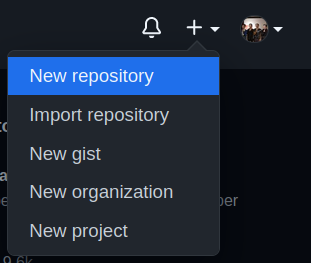
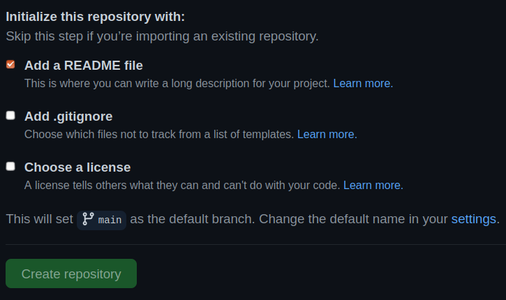
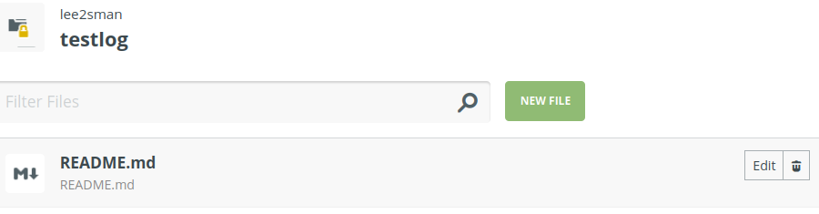

# Intro to P5JS

- Your first p5 sketch
- Review the [Transitioning from Processing tutorial](https://github.com/processing/p5.js/wiki/Processing-transition)
- [Alpha Editor](http://alpha.editor.p5js.org)
  - register and make an account
- Running p5js sketches locally and setting up your editor

## Javascript!

## Program flow

### A basic p5 `sketch`

```
//this is a comment

function setup(){
  createCanvas(500,500);
}

function draw(){
    //main loop
    //each run of draw is a frame
}
```

### variables

Javascript is [weakly typed](https://en.wikipedia.org/wiki/Strong_and_weak_typing)

```
var x = 0;
let y = 0;
```

### functions

We covered setup and draw. There is also

```
function mousePressed(){}

function keyPressed(){}

function keyTyped(){}
```

##### Working with media (images, sound, etc)

```
function preload(){
  //load media here
  img = loadImage('assets/quality_meme.jpg');
  }  
```

[Example code - preloading an image](http://alpha.editor.p5js.org/2sman/sketches/HytoGD7vm)

### Input

```
ellipse(mouseX,mouseY,20);
```

Keypresses, mouse movement and clicks are examples of input and interaction

### Looping

Similar to Processing/Java

```
for (var i = 0; i < 10; i++){
  print(i)    // will print 1, 2, 3...to 9 on separate lines
}
```

Don't forget you may see ```let``` instead of ```var```


### arrays

Arrays can be described literally. They always start with 0.

```
let array = ['zeroeth','first','second','last'];

console.log(array[0]); //will print zeroeth to console
```

##### Add to the end of an array with push

```
let numArray = [0, 1, 2];

array.push(3);
array.push(4);
console.log(array); //will result [0, 1, 2, 3, 4]
```

##### Remove from end of array with pop

```
//continuing from above
array.pop();
console.log(array); //will result [0, 1, 2, 3]
```

# Debugging and the console

### Accessing the Console


Using the Console


Code examples in p5js can be found [here](../basicExamples.md)


## Start your (dev) logs

A devlog is a way to capture our work in progress. 

In this course we will be constantly experimenting. Our work may break. We may do dozens, perhaps hundreds, of iterations while we work. We may produce finished projects and these may serve as in-progress updates, or our projects may not come to fruition and instead live-out in posts with a screenshot or two or a research image and a few lines description and some code snippets. 

Dev stands for development and refers to how we slowly over time work to develop our projects iteratively.

Why keep a devlog (beyond because I'm asking you to for our class)?

Writing about your projects helps you formulate ideas, struggle to find solutions, and let you reflect on choices you may have made intuitively. A devlog serves as a *digital notebook* that you can refer back to later (months, years?) when you need to re-learn how to do something you've forgotten. It's also a way to organize your thoughts. It can turn into sources you refer to when building a portfolio. Or just serve as an internal way to see your own progress in learning and making. It can also be a way to share your own knowledge or art with others. And it may even lead to people getting in touch to talk about your ideas or art. It's also a good practice to keep a devlog when working on longterm projects like one's senior project.

### Example logs

These are example devlogs by artists, designers and programmers writing about their projects and especially their research and mid-stage projects:

- [Naoto Hieda](https://naotohieda.com/blog/) - Japanese artist in Germany - creative coding, livecoding. (They will be visiting our class virtually in March.)
- [Sol Sarratea](https://solquemal.com/) - "freelance developer and computational artist" based in Buenos Aires, Argentina - for example, check her writeup on creating [digitally rotting images](https://solquemal.com/garden/become-rotten)
- [Auriea Harvey](auriea.org/) - Artist, 3d modeling, co-director of game company Tale of Tales. based in Belgium.
- [Szymon Kaliski](https://szymonkaliski.com/) - example post: building a [DIY hardware music instrument](https://szymonkaliski.com/writing/2018-01-28-diy-monome/) - from Poland
- [Laskfar Vortok](https://bildwissenschaft.vortok.info://bildwissenschaft.vortok.info/) - more like a portfolio, but does good job of showing lots of smaller projects - "Born in México; digitized-manifestation is actualized in Internet."
- [Josh Avanier](https://avanier.now.sh/) - a list of Josh's current in-progress projects
- Luis Queral has a [design research](https://www.notion.so/luismqueral/Studio-Log-9aa2029315c647038ba711c41ecbb5c2) blog and a [design for the MTA](https://www.notion.so/MTA-Design-Log-cd07118c8e9648e397a2bebb31ed32e3) log that is great.
- [Alex Bainter](https://medium.com/@alexbainter) has a dev blog on how to write software to generate music on the web.
- I have a mini short-term devlog on a procedurally generated 8bit 2d project I made [here](https://notapipe.itch.io/quiltfolk/devlog/177162/procedural-folks-procedural-quilts). 

## How to host one for free on GitHub pages

I have attempted to simplify this process, but this is still a technical process.

1. Sign into GitHub.com. Make an account if you don't have one. Use a pseudonym.
2. Make a new repository by hitting the + button in the top right and choosing "New Repository". Give it a name like ```lee's devlog``` or whatever you want. I called mine ```algoraves```. Add a short description such as "My class devlog for Drawing, Moving, and Seeing with Code."  
  
3. Check the box that says *Add a README file*. Leave everything else alone and click the *Create Repository* button.
  
4. It will create a new empty repository for you, a place to hold code and text files. This is where we will host the index that links to all of our posts. 
5. Go to [prose.io](https://prose.io). This creates a nice place to post a blog into our repository. Sign in using your GitHub credentials. Click on your new devlog you just created. Let's edit the README file. Add some text that says this is your devlog for your class projects. On the right you can click to preview. When you are done click save. It will highlight your new text in green. Click **commit**.
  
6. Let's add a log entry. Click on your repository name in the top to go back to the parent repository folder. Click New File. In the name field you'll see something like this greyed-out: ```2021-02-11-your-filename.md```. It's good practice to have the date and a name that refers to what you're writing about. Let's change this to ```2021-02-11-algorithmic-walk.md```. The *.md* means this is a [markdown](https://en.wikipedia.org/wiki/Markdown#Example) file.
7. Now click into the post below. Put the title of the post. Write text or paste in your previous text you wrote about your algorithmic walk. Make sure to make it readable. Hit enter twice between paragraphs. Click to add images to your post. It will be added in line in your text. You can move this around. *Note: to make things cleaner, I place my images in an images folder*.
8. Preview. Save. Commit. Click the repo name in the top center to go back.
9. Let's link to our new post from our main page. 
Edit our README.md file. We'll add a link.  ``` [my algorithmic walk](2021-02-11-algorithmic-walk.md) ```
Then preview, save and commit.
1. Go back to GitHub.com and open your repository. Click the Settings/gear. Scroll down to GitHub pages section. Click the button next to Source and choose **main**. You can also choose a theme. It will give you your URL. Wait a few minutes and then it will be live online at that URL.
2. In the future, you can add new pages to your repository by visiting prose.io and repeating steps 6 to 9.

# Weekly project hw

### Read [Harold Cohen and AARON: A 40 Year Collaboration](http://www.computerhistory.org/atchm/harold-cohen-and-aaron-a-40-year-collaboration/), 15 minutes

> “… perhaps AARON would be better described as an expert’s system than as an expert system: not simply because I have served as both knowledge engineer and as resident expert, but because the program serves as a research tool for the expansion of my own expert knowledge rather than to encapsulate that knowledge for the use of others,” Cohen wrote in 1988.

Harold Cohen resisted ascribing human-like characteristics or the appearance of sentience to AARON. In the statement above, he describes AARON as a tool for the expansion of his own expert knowledge. This is a software tool. Describe an example of a theoretical tool (for you) that you could use to make an artwork (or dance, theater piece, music, film, etc - depending on your interest and creative practice). What would the tool do? What kind of functions would it have? What might it be called? What limit might it have that would require you to step in and *collaborate* with your software-tool to finish the piece?

### Use NoPaint - available as iOS app (for free) or on the [web](https://nopaint.art/)

- Make 4 - 10 artworks
- Try using the console
- Write about using NoPaint. Is it your artwork? Are you the collaborator? Are you incidental? What role does randomness play in this art? Or in your art in general? your life in general?
