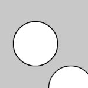
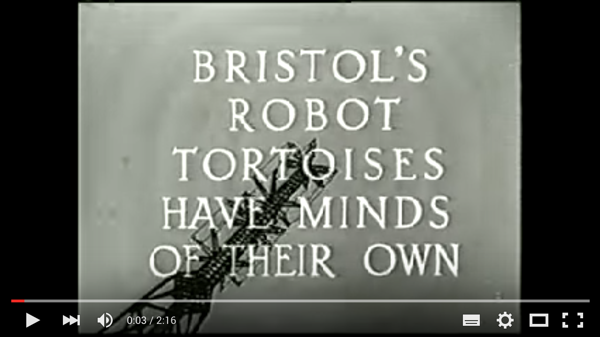
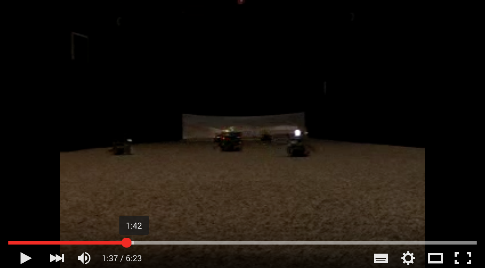
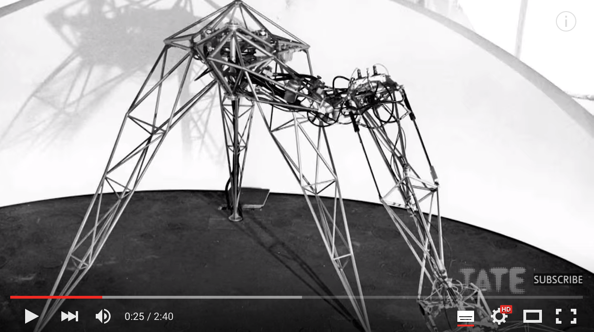
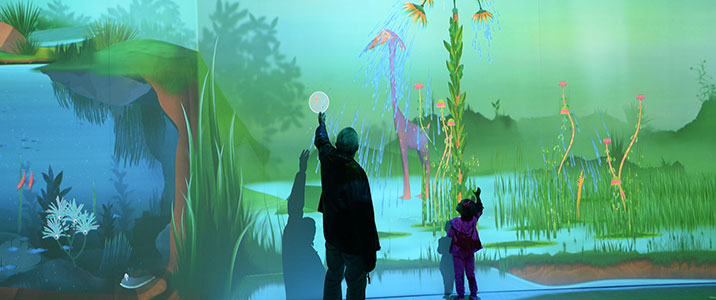
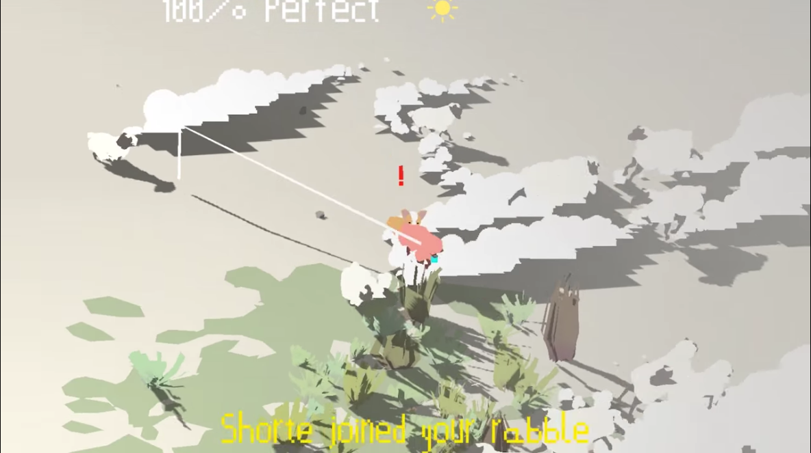
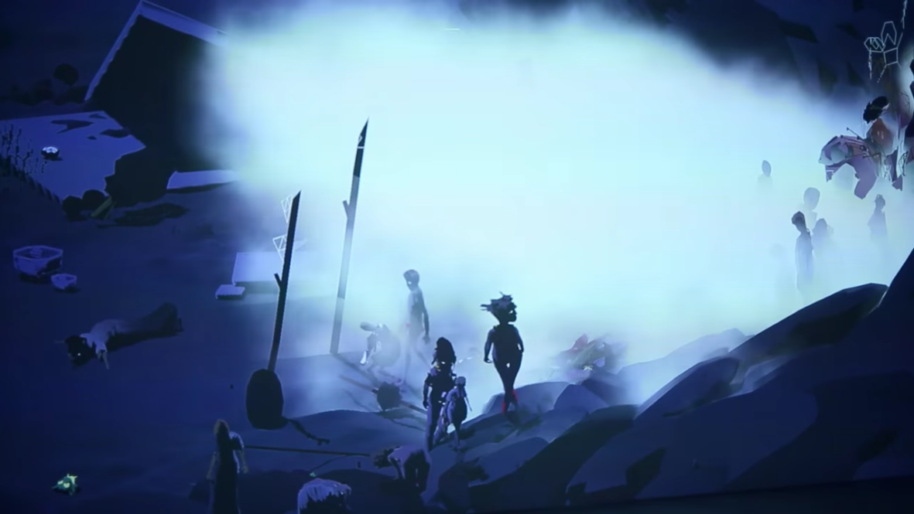
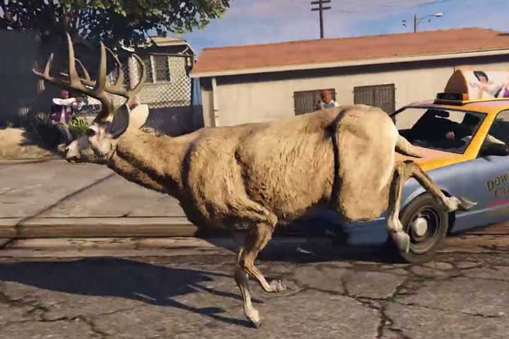
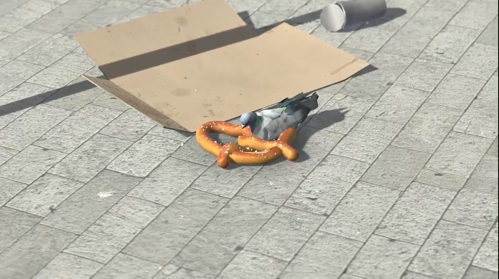

# Week 5

# Fun with Vectors

* Euclidean vector, possesses magnitude and direction ( 2 values )
* when drawn with arrow, indicates direction and length indicates magnitude
* Instead of x, y, xspeed, yspeed we can replace with Vector location, Vector Speed
* Velocity is a vector that stands for the difference between two points in space
* In each frame, new location = velocity applied to current location

### Vector example

*Code examples from Dan Shiffman, The Nature of Code chapter 3*

Vectors require special vector math function, not simple addition/subtraction.

```
function setup(){
  var v1 = createVector(40, 50);
  var v2 = createVector(40, 50);

  ellipse(v1.x, v1.y, 50, 50);
  ellipse(v2.x, v2.y, 50, 50);
  v1.add(v2);
  ellipse(v1.x, v1.y, 50, 50);
}
```



> [P5JS Vector class](https://p5js.org/reference/#/p5.Vector) in the reference, and in the [Web Editor](https://editor.p5js.org/2sman/sketches/SyxkSEPY7).

### Bouncing ball example with vectors

Remember how to program a bouncing ball? There is x and y location, as well as its xspeed and yspeed to control its motion.

[example bouncing ball - no vectors](https://editor.p5js.org/2sman/sketches/Hydp2NvFm)

How can we re-make this example using vectors?

```
// Example 1-2: Bouncing Ball, with p5.Vector!
let position;
let velocity;

function setup() {
  createCanvas(640, 360);
  background(255);
  position = createVector(100, 100);
  velocity = createVector(2.5, 5);
}

function draw() {
  background(255);

  // Add the current speed to the position.
  position.add(velocity);

  if ((position.x > width) || (position.x < 0)) {
    velocity.x = velocity.x * -1;
  }
  if ((position.y > height) || (position.y < 0)) {
    velocity.y = velocity.y * -1;
  }

  // Display circle at x position
  stroke(0);
  strokeWeight(2);
  fill(127);
  ellipse(position.x, position.y, 48, 48);
}
```

[bouncing ball with vectors](https://editor.p5js.org/2sman/sketches/r1aETVwYX)

This is a single ball example. But what if we need to control a dozen balls, or hundreds. What if instead of a bouncing ball this was a type of creature with its own roaming behavior? You guessed it, we need classes!

Let's remake the bouncing ball with vectors as a class that can create individual ball object *instances*.

First, let's reduce our setup and main event loop. Then we'll go and add the actual Ball class.

```
// Example 1-2: Bouncing Ball, with p5.Vector!

let b; //we declare an individual b which will become an instance of the Ball class

function setup() {
  createCanvas(640, 360);
  b = new Ball(); //we create our b instance of Ball
}

function draw() {
  background(255);
  b.update();
  b.display();
}


//our Ball class

class Ball {
  constructor() {
    this.position = new createVector(100, 100);
    this.velocity = new createVector(2.5, 5);
  }

  update() {
    // Add the current speed to the position.
    this.position.add(this.velocity);
    if ((this.position.x > width) || (this.position.x < 0)) {
      this.velocity.x = this.velocity.x * -1;
    }
    if ((this.position.y > height) || (this.position.y < 0)) {
      this.velocity.y = this.velocity.y * -1;
    }
  }
  display() {
    // Display circle at x position
    stroke(0);
    fill(175);
    ellipse(this.position.x, this.position.y, 48, 48);
  }
}


```

[Bouncing ball with vectors and Ball class](https://editor.p5js.org/2sman/sketches/SyjIkrDtm) example

[Array of balls with Ball class and vectors](https://editor.p5js.org/2sman/sketches/S1gpTHdKX)

### Programming our Mover class with Vectors

An object has a location where it is at that given moment as well as a velocity which is instructions for how it should move from one moment to the next. Velocity is added to location.

* Add velocity to location.
* Draw object at location.

```
location.add(velocity);
```

Then we draw the object at the location

```
ellipse(location.x, location.y, 50, 50);
```


What info does a Mover object have?

1. It moves
2. It gets shown (drawn to screen)

```
  update() {
     location.add(velocity); //The Mover moves
   }

  display() {
     stroke(0);
     fill(175);

     ellipse(location.x,location.y,16,16); // The Mover is displayed.
  }

}
```

We also need the object constructor, which is invoked ```let m = new Mover();```

To start, we'll give random location and velocity to each Mover instance

```
class Mover {
  constructor(){
    this.position = createVector(random(width), random(height));
    this.velocity = createVector(random(-2, 2), random(-2, 2));
  }
```

* Rest of [starter code for Mover class](https://editor.p5js.org/2sman/sketches/HJVKmHwKm)

#### Acceleration

Acceleration is the rate of change of velocity. Velocity is the rate of change of location. Acceleration affects velocity and then velocity affects location.

In code:

```
velocity.add(acceleration);
location.add(velocity);
```

We can update our Mover constructor and update function to incorporate acceleration. Everything else will remain the same.

```
class Mover{
  constructor(){
    this.position = createVector(width/2,height/2);
    this.velocity = createVector();
    this.acceleration = createVector(-0.001, 0.01);
    this.topspeed = 10;
  }

  update() {
    this.velocity.add(this.acceleration);
    this.velocity.limit(this.topspeed);
    this.position.add(this.velocity);
  }

```

full [example code](https://editor.p5js.org/2sman/sketches/SJL1BHwFm) for Mover with constant acceleration

#### Random acceleration

If we want a randomized acceleration, we need to use random2D() in our update function, to create a random vector. [random2d()](https://p5js.org/reference/#/p5.Vector/random2D) in reference.

```
update() {
  this.acceleration = p5.Vector.random2D();
  this.velocity.add(this.acceleration);
  this.velocity.limit(this.topspeed);
  this.position.add(this.velocity);
}
```

full [code example](https://editor.p5js.org/2sman/sketches/SkClNluKX)

## Resources

* Do the exercises in Nature of Code chapter 1 on vectors and review the Shiffman videos on Vectors as needed. All Chapter 1 Vectors code translated into p5js [here](https://github.com/shiffman/The-Nature-of-Code-Examples-p5.js/tree/master/chp01_vectors).


# Artificial Life: Virtual Creatures and other Machines

### More on automatons

Early explorations of artificial life are the automatons of the 1700s. One of the earliest is the Digesting Duck created by Jacques de Vaucanson in 1739. The mechanical duck appeared to have the ability to eat kernels of grain, and to metabolize and defecate them.   

  

As [Simon Norfolk observes,](http://www.instituteartist.com/feature-I-m-Sorry-Dave-I-m-Afraid-I-Can-t-Do-That-Simon-Norfolk) the duck provoked a philosophical crisis:   

> "If it could perform so many functions that were like life and yet it was a machine, then it begged the question what exactly is life? For the first time with any clarity it raised the important question ‘in what way do humans essentially differ from very complicated machines?’

Of course it was later revealed that the duck did not actually metabolize but was preloaded with ducky dung. Decades later the [Mechanical Turk automaton](https://en.wikipedia.org/wiki/The_Turk) - a chess playing robot that appeared to be able to win against very skilled human players, provoked a related question of human versus machine intelligence.

  

Yet once again it was found to be a fraud.  Wolfgang von Kempelen, had designed it with a secret compartment inside, where he would pay retired grand master chess players to hide and play against opponents, controlling pieces using levers. Amazon has very cynically named their [online labor service MTurk](https://www.mturk.com/mturk/welcome) in reference to this.

Science fiction is full of [intelligent artificial life forms](https://en.wikipedia.org/wiki/Artificial_intelligence_in_fiction) which embody out hopes, dreams and anxieties for the technologies we build. These characters pose questions of control, agency and what it means to be human.


### Cybernetics and emergence

The interdisciplinary field of cybernetics that emerged after WW2 also explores these questions. Of note, are the cybernetic experiments of Dr. Grey Walter an English neurologist and roboticist. In 1949 Walter built [reactive autonomous robots](http://www.theoldrobots.com/ElmerElsie.html) without the aid of computer processors or micro-controllers, these could wander about and avoid obstacles. Most famous were his turtles Elmer and Elsie which he thought of as electronic 'brains'.  

  
*Turtles, [video](https://www.youtube.com/embed/lLULRlmXkKo)

Walter's turtles were a proposition that intelligence is not a higher level property and rather is, situated, emergent and pre-cognitive. They are still widely cited in cybernetic literature today.   

A more recent example of an artist exploring of these theme's today, is the early work of [Heather Dewey Hagborg.](http://deweyhagborg.com/) In this video she describes some key concepts of her work Bugs, and artificial life such as emergence, bottom up models for intelligence and the irreducibility of complex systems.   

  
*Bugs, by Heather Dewey-Hagborg - [video](https://www.youtube.com/watch?v=rmKMiAze-3Q)*

### Artificial Life in Media Art

Media art history is packed with examples of artificial lifeforms that consider the cultural, aesthetic and political implications of the promise of technology, what it means to be think, be alive, or have intelligence. [Mitchell Whitelaw](http://mtchl.net/) gives a solid review of the field in [MetaCreation.](https://mitpress.mit.edu/books/metacreation).

Some key examples of artificial life artworks are:  

* The quite terrifying [Senstor by Edward Ihnatowicz](http://www.senster.com/ihnatowicz/), 1974.  



* Many examples of [Laurent Mignonneau & Christa Sommerer's](http://www.interface.ufg.ac.at/christa-laurent/) artworks. Who have also done fantastic work developing tangible and unusual interfaces using [water](https://www.youtube.com/watch?v=cZ3v1jcCXmk), [plants](http://www.interface.ufg.ac.at/christa-laurent/WORKS/FRAMES/FrameSet.html), [typewriters.](http://www.interface.ufg.ac.at/christa-laurent/WORKS/FRAMES/FrameSet.html)

  

* A more recent contribution is [Delicate Boundaries](http://csugrue.com/delicateboundaries/) by [Chris Sugrue](http://chrissugrue.com/)
  

* And the software based creatures curated by [Golan Levin](http://www.flong.com/) in his [Single Cell](http://www.singlecell.org/singlecell.html) and [Double Cell](http://www.singlecell.org/) collections of Processing works.  
   

We could also consider the non-art realm, such as General Dynamics' [Big Dog](https://www.youtube.com/watch?v=cNZPRsrwumQ).

# Other ecosystems

Connected Worlds is a work at New York Hall of Science, by Design I/O with Columbia's Center for International Earth Science Information Network, Yale's Cognitive Science Department, NYU's Games for Learning Institute, artist [Zach Gage](http://www.stfj.net/), and Big Show Construction Management

  
*[video](https://vimeo.com/131725811)*

While interacting with Connected Worlds, visitors explore the interconnectedness of different environments, strategize to keep systems in balance and experience how individual and collective actions can have widespread impact. As visitors explore and play, their actions – gestures, movements, decisions – have both short and long-term effects on the digital environments. These effects are based on core concepts of sustainability science including feedback loops, equilibrium in a dynamic environment, and casual links and influences.

Artist Ian Cheng describes his work as simulations. They explore mutations, human behaviors, and chaotic emergent behavior.

Ian Cheng's Bad Corgi



Another, <a href="https://www.youtube-nocookie.com/embed/ByJrszDVxmA?rel=0">Emissary In The Squat of the Gods</a>, one of a trio of works that were presented together at PS1 in 2017.



Brent Watanabe's Deer Cam

San Andreas Deer Cam is a live video stream from a computer running a hacked modded version of Grand Theft Auto V, hosted on Twitch.tv. The mod creates a deer and follows it as it wanders throughout the 100 square miles of San Andreas, a fictional state in GTA V based on California. The deer has been programmed to control itself and make its own decisions, with no one actually playing the video game.



Theo Trian's work is created in the Unity game engine. Characters or elements have behaviors in a closed ecosystem. This is prometheus, which features a pigeon pursuing (pecking) a pretzel.



## Homework

* Check out how to normalize a vector - [example](https://editor.p5js.org/2sman/sketches/SksO4QOK7)
* Watch Vectors tutorial [video](https://www.youtube.com/watch?v=7eBLAgT0yUs&index=6&list=PLRqwX-V7Uu6ZwSmtE13iJBcoI-r4y7iEc) on acceleration toward the mouse and/or read section 1.10 in Nature of Code. Review any earlier videos on Vectors as needed.
* [Read Chapter 2](https://natureofcode.com/book/chapter-2-forces/) of Nature of Code through section 2.5 on Creating Forces. P5JS code for chapter is [here](https://github.com/shiffman/The-Nature-of-Code-Examples-p5.js/tree/master/chp02_forces).
* Create a new basic creature with vectors. Try to include a force as well if you can. Don't spend as much time on design/aesthetics as you do thinking through modeling its behavior and then implementing this in code. Submit this code online and be prepared to show it in class.
* Read the Introduction of Mitchel Whitelaw's metacreation
* Write a devlog and show examples of *artificial life* or a project exploring *emergence* that you have found that relates to the ideas in this text. This could either be from an artwork, a computer program or a real life process. Investigate it further online. How does it demonstrate emergence/bottom-up design?


*Artificial Life section originally adapted from [Tega Brain](https://github.com/tegacodes/Drawing-Seeing-Moving-with-Code/blob/gh-pages/docs/lectures/L-05.md)*

