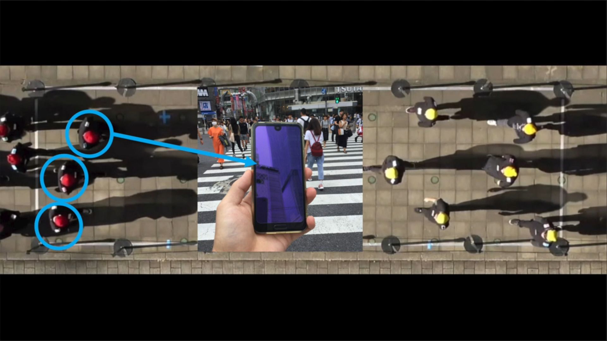
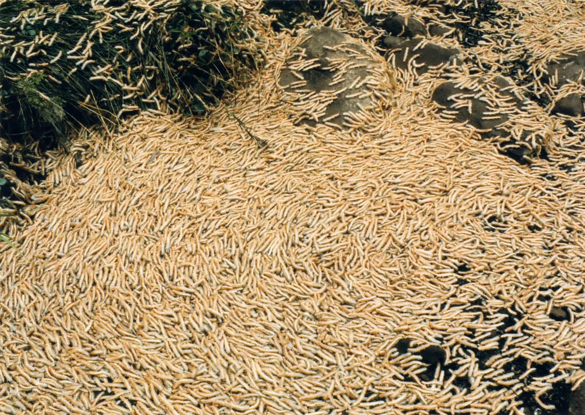
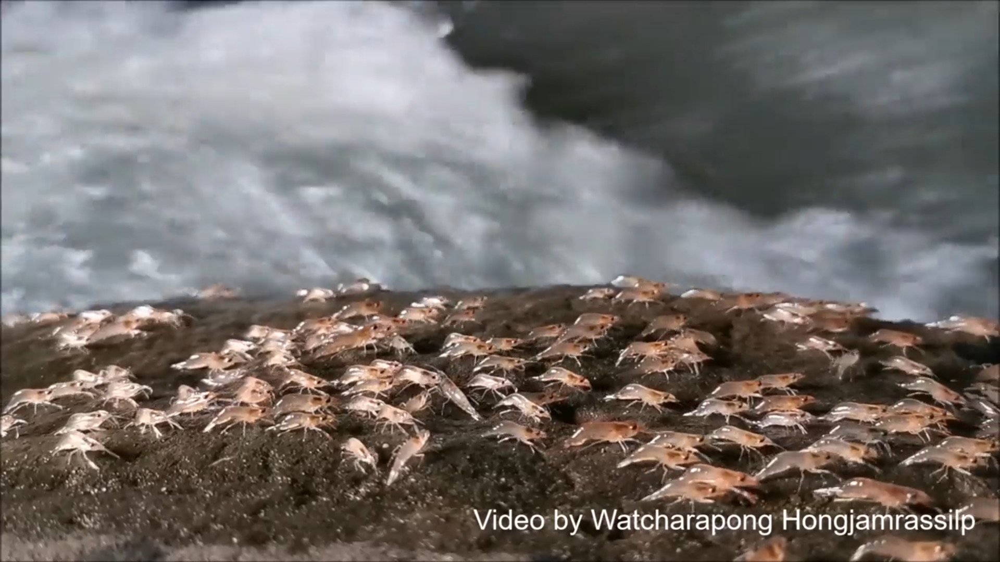

# Week 7

- UPCOMING ART & CODE EVENTS
  - algorithmic literature event WordHack tonight 
  - livecoding algorave tomorrow night *--info below and on Discord*
  - Lecture by Auriea Harvey next Wednesday at 5pm!
- Code:
  - Working with Arrays
  - Collision 
- Swarming in art and code
- Livecoding jam 

## Events this week: Auriea Harvey Guest Lecture + WordHack + Livecoding

Part of my goal as a professor is to introduce you to the wider field of New Media art in general, and the world of artists working with code in particular. We have 3 exciting events of this kind this coming week: performances and computational writing tonight, an algorave tomorrow and a lecture by a pioneering diginal new media artist and game designer next Wednesday.

### Auriea Harvey next Wednesday at 5pm  

[Event info and RSVP](https://www.purchase.edu/live/events/26696-new-media-lecture-series-auriea-harvey)

For the second of our spring New Media Lecture Series speakers we are pleased to have [Auriea Harvey](http://auriea.org/About) joining us.

Auriea’s work spans every area we teach in New Media, and beyond. She’s a pioneering net artist, a sculptor, and an experimental game designer for [Tale of Tales](http://www.tale-of-tales.com/index.php) with a focus on storytelling in 3d and XR alongside her partner Michaël Samyn, together making up the duo [Entropy8zuper!](http://www.entropy8zuper.org/). Auriea’s solo exhibition Year Zero is currently on view at bitforms gallery in New York. 

### WordHack Tonight!

Wordhack at 7pm - [info](https://withfriends.co/event/9815928/wordhack_online_w_nick_montfort_angie_waller_and_alan_sondheim)  - watch via [twitch.tv/babycastles](https://twitch.tv/babycastles)

### Livecoding TOMORROW!

Livecode.nyc at Currents.fm 7pm to midnight - [info/stream](https://a.currents.fm/common/event/BOSqxWMbkecFZlX45NM4) 

```
//LINEUP
// Melody Loveless + ColonelPanix
// Kengchakaj + Nitchafame
// Messica Arson
// Maxwell Neely-Cohen + gwenpri.me
// Luisa Mei + Char Stiles
// Dan Gorelick + solquemal
// eeeeaaii + haute.rod
// Sophia Sanborn + Indira Ardolic
// Andrew Cotter + lzkpa
// Codenobi + Wookie
```

### Random movers - objects in an array

```
var creature = [];

function setup() {
  createCanvas(windowWidth, windowHeight);
  background(100);

  //fill array
  for (var i = 0; i < 5; i++) { //loop 5 times
    //put an object in the array for each loop
    var d = random(100, 200);
    creature[i] = new Creature(width / 2, height / 2, d, d);

  }
  noStroke();
}

function draw() {
  background(255);
  for (var i = 0; i < 5; i++) { //loop 5 times
    creature[i].display(); //run the display function of the object
    creature[i].move();
  }
}

class Creature {

  constructor(x, y, w, h) { 
    this.position = createVector(x, y);
    this.w = w;
    this.h = h;
    this.color = color(random(255),random(255),random(255),100);
    this.n = createVector(random(2),random(2)); //generate random starting noise variables; 
    this.p = createVector(0,0); //position variable
    this.inc = 0.005; //noise variable increment
  }

  //Functions 
  display() {
    fill(this.color);
    ellipse(this.position.x, this.position.y, this.w, this.h);
    this.w += random(-1, 1);
    this.h += random(-1, 1);
  }

  move() {
    this.p.x = noise(this.n.x);
    this.p.y = noise(this.n.y);

    this.position.x = map(this.p.x, 0, 1, 0, width);
    this.position.y = map(this.p.y, 0, 1, 0, height);

    this.n.x = this.n.x + this.inc;
    this.n.y = this.n.y + this.inc;
  }
}
```

[Code](https://editor.p5js.org/2sman/sketches/GdB8wRBC1)

#### Notes on Arrays

We have made lots of use of ```array.length```, for example when looping to create new objects in an array, or in our draw to loop through all elements of an erray and run their methods. There are other useful array methods as well.

```
array.push();
```

```
let array = [22, 10, 8, 4, 9];
array.push(300);
  
console.log("last element in the array: " + array[array.length-1]);
```

This adds a new element to the end of the array.

```
indexOf(element)
```

example

```
print(array.indexOf(8)); //returns 2 because it's the second index in the array set above
```

Returns the index of given element, or returns -1 if it's not found.

```
var array = [2, 5, 9];   
var index = array.indexOf(2); // 0   
index = array.indexOf(7); // -1   
```

```
splice()
```

Unlike in Processing, arrays in Javascript (and p5.js) may change their length. In other words, you can add and remove elements from an array. 

Remove one element from an array. In a for loop, start at the end so that array.length doesn't get confused.


Starter code

```
let particles = [];

function setup() {
  noCanvas();
  
  for (let i = 0; i < 10; i++){
    particles[i] = new Particle(random());
  }
  
  
//go backwards, counting from end of array to beginning
  for (var i = particles.length-1; i >= 0; i--) {

    var p = particles[i]; //put particle into p   
    
    p.run();    
    
    if (p.isDead()) {   
      //remove the particle   
      particles.splice(i, 1); //remove particle at i   
    }  
  }
  
  print(particles);
}

class Particle{
  constructor(chance){
    this.alive = true;
    this.chance = chance;
  }
  run(){
    
  }
  isDead(){
    if (this.chance>0.5){
      return false;
    } else {
      return true;
    }
  }
  
}
```


## Swarms




[If You Look at Your Phone While Walking, You’re an Agent of Chaos](https://www.nytimes.com/2021/03/18/science/distracted-walking-phone.html), from The New York Times

- [Walking while distracted](https://vp.nyt.com/video/2021/03/17/92528_1_17tb-crosswalk-video_wg_720p.mp4) - video



- from [Millipede Swarms Once Stopped Japanese Trains in Their Tracks](https://www.nytimes.com/2021/01/12/science/millipede-swarms-japan-train.html)

Zombie Crabs

<iframe title="New York Times Video - Embed Player" width="480" height="321" frameborder="0" scrolling="no" allowfullscreen="true" marginheight="0" marginwidth="0" id="nyt_video_player" src="https://www.nytimes.com/video/players/offsite/index.html?videoId=100000004321333"></iframe>

- from [Uncovering a Swarm of Zombie Crabs](https://www.nytimes.com/2016/04/15/science/uncovering-a-deep-sea-swarm-of-zombie-crabs.html)

  

[These Shrimp Leave the Safety of Water and Walk on Land. But Why?](https://www.nytimes.com/2020/11/18/science/shrimp-parade-thailand.html)


### Swarming and A-life Artworks

*some sources orginally from Golan Levin, thank you*

Adria Navarro - [Generative Play](http://adrianavarro.net/projects/generative-play/)

Conway's Game of Life - [in p5.js](https://sklise.github.io/conways-game-of-life/)

Dan Shiffman's Boids - [in p5.js](https://editor.p5js.org/golan/sketches/uiuvKNohe)

zrispo - [worm](https://zrispo.co/worm/)

# Resources

classes and objects with ES6 style in p5.js - [video](https://www.youtube.com/watch?v=T-HGdc8L-7w) on The Coding Train (YouTube)

# Homework

- Review Chapter 4 in Nature of Code on Particle Systems.
- P5js examples are in [here.](https://github.com/shiffman/The-Nature-of-Code-Examples-p5.js/tree/master/chp04_systems)
- Daniel Shiffman [tutorials](https://www.youtube.com/watch?v=vdgiqMkFygc&list=PLRqwX-V7Uu6Z9hI4mSgx2FlE5w8zvjmEy)
- Read [How Do Simple Programs Behave](http://www.wolframscience.com/nks/p23--how-do-simple-programs-behave/) by Steven Wolfram
